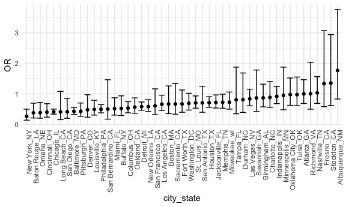
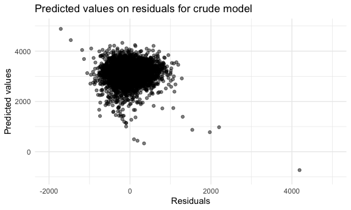
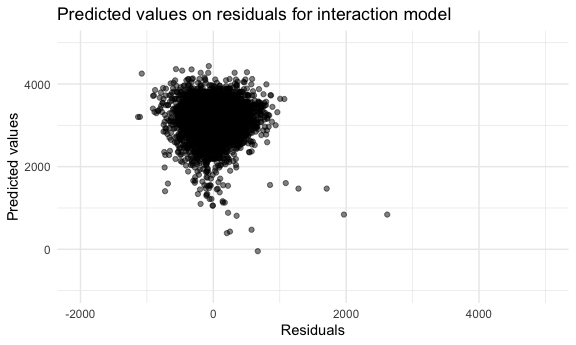
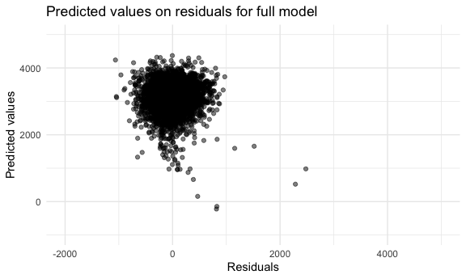
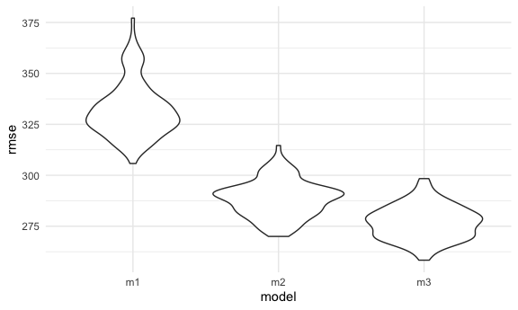
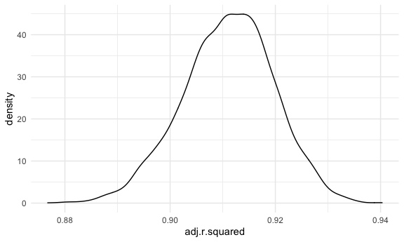
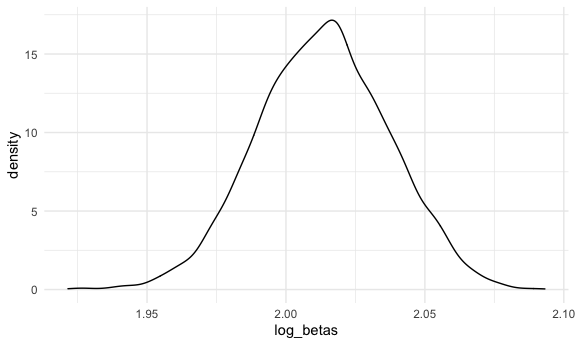

Homework 6
================

\#\#Problem 1

``` r
homicide_df = 
  read_csv("data/homicide-data.csv", na = c("", "NA", "Unknown")) %>% 
    mutate(
        city_state = str_c(city, state, sep = "_"),
        victim_age = as.numeric(victim_age),
        resolution = case_when(
        disposition == "Closed without arrest" ~ 0,
        disposition == "Open/No arrest"        ~ 0,
        disposition == "Closed by arrest"      ~ 1,
      )
    ) %>% 
  filter(
    !city_state %in% c("Tulsa_AL", "Dallas_TX", "Phoenix_AZ", "Kansas City_MO"),
    victim_race %in% c("Black", "White")    
    ) %>% 
  select(city_state, resolution, victim_age, victim_race, victim_sex)
```

Start with one city

``` r
baltimore_df = 
  homicide_df %>% 
  filter(city_state == "Baltimore_MD")
glm(resolution ~ victim_age + victim_race + victim_sex, 
    data = baltimore_df,
    family = binomial()) %>% 
  broom::tidy() %>% 
  mutate(
    OR = exp(estimate),
    CI_lower = exp(estimate - 1.96 * std.error),
    CI_upper = exp(estimate + 1.96 * std.error)
  ) %>% 
  select(term, OR, starts_with("CI")) %>% 
  knitr::kable(digits = 3)
```

| term              |    OR | CI\_lower | CI\_upper |
| :---------------- | ----: | --------: | --------: |
| (Intercept)       | 1.363 |     0.975 |     1.907 |
| victim\_age       | 0.993 |     0.987 |     1.000 |
| victim\_raceWhite | 2.320 |     1.648 |     3.268 |
| victim\_sexMale   | 0.426 |     0.325 |     0.558 |

Do it for every city in the dataset. First nest the dataset and then fit
the dataset for each city.

``` r
models_results_df =
homicide_df %>%
  nest(data = -city_state) %>% 
  mutate(
    models = map(.x = data, ~glm(resolution ~ victim_age + victim_race + victim_sex, data = .x,
                                family = binomial())),
    results = map(models, broom::tidy)
  ) %>% 
  select(city_state, results) %>% 
  unnest(results) %>% 
  mutate(
    OR = exp(estimate),
    CI_lower = exp(estimate - 1.96 * std.error),
    CI_upper = exp(estimate + 1.96 * std.error)
  ) %>% 
  select(city_state, term, OR, starts_with("CI"))
```

### Make a plot of the ORs

In each of these 50 cities are male homicide victims more or less likely
to have homicide resoled by arrest compared to female victims

``` r
models_results_df %>% 
  filter(term == "victim_sexMale") %>% 
  mutate(city_state = fct_reorder(city_state, OR)) %>% 
  ggplot(aes(x = city_state, y = OR)) + 
  geom_point() + 
  geom_errorbar(aes(ymin = CI_lower, ymax = CI_upper)) + 
  theme(axis.text.x = element_text(angle = 90, hjust = 1))
```



## Problem 2

Read in the data

``` r
baby_df = 
  read_csv("./data/birthweight.csv") %>% 
  mutate(
    babysex = as_factor(babysex),
    frace = as_factor(frace),
    malform = as_factor(malform),
    mrace = as_factor(mrace),
    parity = as_factor(parity),
    pnumsga = as_factor(pnumsga),
    prior_lbw = case_when(
      pnumlbw == 0 ~ 0,
      pnumlbw > 0  ~ 1
    ),
    prior_lbw = as_factor(prior_lbw)
  )
```

#### Fit the models

We will compare three models: a crude model(m1) with just length and
gestational weeks; an interactions model(m2) with head circumference,
length, sex, and all interactions (including 3-way); and a full
model(m3), that includes head circumference, length, sex, mother’s race,
family income, presence of malformations, and the interaction of
mother’s pre-pregnancy weight and her gestational weight.

``` r
model_m1 = lm(bwt ~ blength + gaweeks, data = baby_df)
model_m2 = lm(bwt ~ bhead * blength * babysex, data = baby_df)
model_m3 = lm(bwt ~ bhead + blength + babysex + mrace + fincome + malform + delwt * ppwt, 
                data = baby_df)
```

We will now create the residuals and predicted values for each model.

``` r
m1_df = 
  baby_df %>% 
  modelr::add_residuals(model_m1) %>% 
  modelr::add_predictions(model_m1)
  
m2_df = 
  baby_df %>% 
  modelr::add_residuals(model_m2) %>% 
  modelr::add_predictions(model_m2)
m3_df = 
  baby_df %>% 
  modelr::add_residuals(model_m3) %>% 
  modelr::add_predictions(model_m3)
```

Plotting the residuals and predicted values for each model.

``` r
m1_resid_plot = 
  m1_df %>% 
  ggplot(aes(x = resid, y = pred)) +
  geom_point(alpha = 0.5) +
  xlim(-2000, 5000) +
  ylim(-1000, 5000) +
  labs(
    title = "Predicted values on residuals for crude model",
    x = "Residuals",
    y = "Predicted values"
  )
m2_resid_plot = 
  m2_df %>% 
  ggplot(aes(x = resid, y = pred)) +
  geom_point(alpha = 0.5) +
  xlim(-2000, 5000) +
  ylim(-1000, 5000) +
  labs(
    title = "Predicted values on residuals for interaction model",
    x = "Residuals",
    y = "Predicted values"
  )
m3_resid_plot = 
  m3_df %>% 
  ggplot(aes(x = resid, y = pred)) +
  geom_point(alpha = 0.5) +
  xlim(-2000, 5000) +
  ylim(-1000, 5000) +
  labs(
    title = "Predicted values on residuals for full model",
    x = "Residuals",
    y = "Predicted values"
  )
m1_resid_plot
```



``` r
m2_resid_plot
```



``` r
m3_resid_plot
```



The interaction and full models are very similar, the crude model has
much larger residuals and predicted values. Thus, the crude model is
likely a poorer fit for the data.

We will do soe cross-validation now to understand more-

``` r
cv_df =
  crossv_mc(baby_df, 100) %>% 
  mutate(
    train = map(train, as_tibble),
    text = map(test, as_tibble),
    m1_mod = map(.x = train, ~lm(bwt ~ blength + gaweeks, data = .x)),
    m2_mod = map(.x = train, ~lm(bwt ~ bhead * blength * babysex, data = .x)),
    m3_mod = map(.x = train, ~lm(bwt ~ bhead + blength + babysex + mrace + fincome + 
                                    malform + delwt * ppwt, data = .x)),
    rmse_m1 = map2_dbl(.x = m1_mod, .y = test, ~rmse(model = .x, data = .y)),
    rmse_m2 = map2_dbl(.x = m2_mod, .y = test, ~rmse(model = .x, data = .y)),
    rmse_m3 = map2_dbl(.x = m3_mod, .y = test, ~rmse(model = .x, data = .y))
  )
cv_plot = 
  cv_df %>% 
  select(starts_with("rmse")) %>% 
  pivot_longer(
    everything(),
    names_to = "model",
    names_prefix = "rmse_",
    values_to = "rmse"
  ) %>% 
  mutate(model = fct_inorder(model)) %>% 
  ggplot(aes(x = model, y = rmse)) +
  geom_violin()
cv_plot
```



The full model(model 3) will be the best fir for data because it has the
lowest root mean squared error (rmse).

## Problem 3

Read in the data

``` r
weather_df = 
  rnoaa::meteo_pull_monitors(
    c("USW00094728"),
    var = c("PRCP", "TMIN", "TMAX"), 
    date_min = "2017-01-01",
    date_max = "2017-12-31") %>%
  mutate(
    name = recode(id, USW00094728 = "CentralPark_NY"),
    tmin = tmin / 10,
    tmax = tmax / 10) %>%
  select(name, id, everything())
```

The dataset for this problem has 365 rows. The variables in this dataset
are: date, id, name, prcp, tmax, tmin.

Using **boot\_sample** function to draw bootstrap samples.

``` r
boot_sample = function(df) {
  
  sample_frac(df, replace = TRUE)
  
}
```

#### Analyzing R squared.

``` r
boot_straps = 
  data_frame(
    strap_number = 1:5000,
    strap_sample = rerun(5000, boot_sample(weather_df))
  )
```

    ## Warning: `data_frame()` is deprecated as of tibble 1.1.0.
    ## Please use `tibble()` instead.
    ## This warning is displayed once every 8 hours.
    ## Call `lifecycle::last_warnings()` to see where this warning was generated.

``` r
bootstrap_results_1 = 
  boot_straps %>% 
  mutate(
    models = map(strap_sample, ~lm(tmax ~ tmin, data = .x) ),
    results = map(models, broom::glance)) %>% 
  select(-strap_sample, -models) %>% 
  unnest(results) 
bootstrap_results_1 %>%
  ggplot(aes(x = adj.r.squared)) + 
  geom_density()
```



From the plot of adjusted R square, we can see that its distribution
looks like normal distribution, with a peak between 0.90 and 0.92.

The 95% CI of adjusted R square is: (0.8934048 , 0.9272809).

#### Analyzing log of the product of betas.

``` r
log_beta_p = function(df) {
    log(df[1,2]*df[2,2]) %>% 
    tibble() %>% 
    mutate(
      log_betas=.$estimate) %>% 
    select(log_betas)
}
```

``` r
bootstrap_results_2=
  boot_straps %>% 
  mutate(
    models = map(strap_sample, ~lm(tmax ~ tmin, data = .x) ),
    results = map(models, broom::tidy),
    log_betas = map(results, log_beta_p)) %>% 
  select(-strap_sample, -models) %>%
  unnest(log_betas)
```

``` r
bootstrap_results_2 %>%
  ggplot(aes(x = log_betas)) + 
  geom_density()
```



From the plot of log of the product of betas, we can see that its
distribution also looks like normal distribution, with a peak between
2.00 and 2.025.

The 95% CI of log of the product of betas is: (1.9669417 , 2.0585284).
